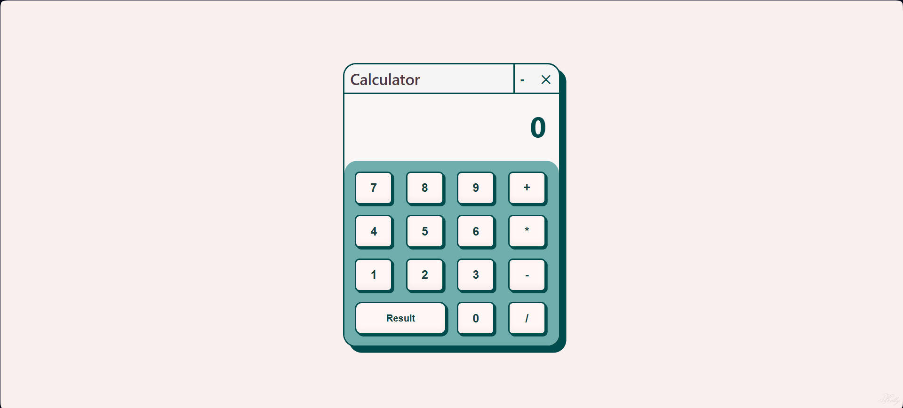

# Calculator Web Application

A sleek, responsive calculator web application built with HTML, CSS, and vanilla JavaScript. This calculator provides basic arithmetic operations with a clean, modern interface.

## Features

- Basic arithmetic operations (addition, subtraction, multiplication, division)
- Responsive design that works on desktop and mobile devices
- Clean, modern UI with a teal color scheme
- Real-time expression display
- Error handling for division by zero
- Window-style interface with minimize and close buttons (UI only)

## Technologies Used

- HTML5
- CSS3 (with Flexbox for layout)
- JavaScript (ES6+)
- Google Fonts (Monsieur La Doulaise)

## Getting Started

### Prerequisites

- A modern web browser (Chrome, Firefox, Safari, Edge)
- No server required - runs directly in the browser

### Installation

1. Clone the repository or download the source code
   ```bash
   git clone https://github.com/yourusername/calculator-app.git
   ```
2. Navigate to the project directory
   ```bash
   cd calculator-app
   ```
3. Open `index.html` in your preferred web browser

## Usage

1. Click the number buttons to input values
2. Use the operator buttons (+, -, *, /) to perform calculations
3. Press the "Result" button to see the calculation result
4. The current expression is displayed above the result

## Keyboard Support

- Numbers: 0-9
- Operators: +, -, *, /
- Enter: Calculate result
- Backspace: Clear last digit (coming soon)
- Escape: Clear all (coming soon)

## Screenshot



## File Structure

```
calculator/
├── index.html      # Main HTML structure
├── style.css      # Styling and layout
└── script.js      # Calculator functionality
```

## Contributing

Contributions are welcome! Please feel free to submit a Pull Request.

## License

This project is open source and available under the [MIT License](LICENSE).

## Acknowledgments

- Inspired by classic calculator applications
